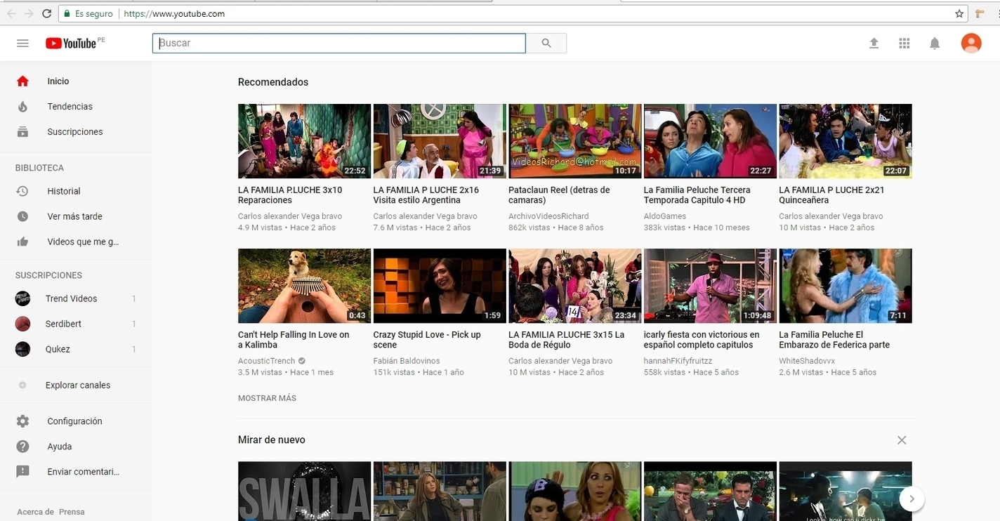

# Red social: 'Youtube'#

En este ejercicio, señalaremos las partes de la web que corresponden a UX y UI.

### UX
-  El botón que te redirige a Home, a la página principal.
- Poder tener un registro de tu historial y acceder a él.
- Acceder a los diferentes trendings que existen  (Music, sports, gaming, etc...)
- La opción de crear tu propia cuenta o canal y poder loguearte.
- La opción 'settings' para poder configurar tu cuenta o canal.
- La opción 'send feedback' para poder aportar con tus sugerencias y posibles mejores a la página.
- La opción 'help' para poder consultar tus dudas respecto a la funcionalidad de Youtube.
- Un buscador donde ingresar, a través de palabras clave, al video o canal de youtube que tengas en mente.
- Una opción para buscar específicamente canales de Youtube ('Browse channels').
- El botón 'upload' para cargar directamente un video y subirlo.
- El botón 'Youtube apps' para ver las diferentes aplicaciones desarrolladas por la marca: Youtube Kids, Youtube TV, etc...
- La opción de cambiar el idioma de la página web.
- La opción de poder cambiar el 'theme' o estilos básicos de la página web a tu gusto.
- EL poder cambiar la localización desde donde estás ingresando a la página web.
- La opción para poder cambiar la interfaz a la anterior por si no te sientes cómodo(a).
- La opción para restringir videos inapropiados en 'Restricted Mode'.
- Youtube te deja ver sugerencias de video de acuerdo a los videos que has visto recientemente.
- El poder dar 'like' o 'dislike' a un video.
- La opción de suscribirte a un canal.
- EL poder cambiar el tamaño de video en las tres opciones predeterminadas que existen.
- La opción para cambiar la calidad de video.
- La opción de poner subtítulos.
- La opción de 'autoplay', quitar las anotaciones y la cambiar la velocidad del video.
- La opción de dar play, pause, editar el volumen del audio y pasar al siguiente video que aparece en el reproductor.
- EL poder ver el tiempo del video y saber cuándo va a terminar.
- El poder ver una lista de videos relacionados a la derecha, dependiendo del autor del canal o según los tags del video que estoy viendo.
- EL poder añadir un comentario, leer los comentarios dejados por otros e interactuar con ellos dando 'like' o 'dislike' o incluso responderles.
- La opción de compartir el video en otras redes sociales u obtener el link con opción a cambiar el tamaño del reproductor una vez lo inserte.
- La opción de 'ver más tarde'.
- La opción de reportar el video por inadecuado.
- El poder ingresar a otros canales en la red social y ver el material subido por ellos.
- La opción para crear listas de reproducción.
- La opción de poder recibir notificaciones de otros usuarios o de mi propio canal.

### UI
- Los colores usados en el diseño de la página web y que van de acuerdo a la 'marca'.
- La posición de cada cosa en la web, el reproductor del video, la sección comentarios, la sección de video relacionados, etc...
- El tamaño y fuente de las letras.
- Los diferentes cambios ante los eventos, como el color celeste al darle al 'Autoplay', el color rojo de una nueva notificación o al hacerle hover a los elementos.
